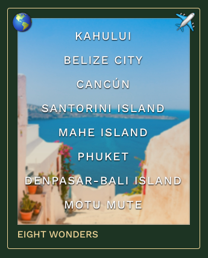

# Eight Wonders

https://eight-wonders.fly.dev/

**Eight Wonders** is a flight path optimizer which finds the shortest path between a series of airports.

Have you ever wanted to fly around the world to visit your bucket list destinations? We'll help you create an itinerary that minimizes time spent on the plane. You can start an itinerary from scratch or customize one of our favorites such as *Michelin Star Dining* or *Festivals!*. Select up to 8 airports, and we'll automatically sort them in the optimal flight order. You can also make notes on the experiences you want to have at each place. Bon voyage! :airplane:

### Why Eight?

The idea is that you can visit the [Seven Wonders of the World](https://en.wikipedia.org/wiki/Wonders_of_the_World), and whichever you consider to be the Eighth Wonder!

## Features

### :earth_americas: Customize an Itinerary

### :pencil2: Edit Your Itinerary

### :iphone: Take a Screenshot and Share

### :world_map: Generate a Link to [Great Circle Mapper](http://www.gcmap.com/)

## How it Works

Eight Wonders is an project built halfway through the [Launch School](https://launchschool.com/) Core Curriculum. The material covered by this point includes fundamental Ruby syntax, OOP, closures, regex, testing, application packaging, deployment, networking, databases, HTML & CSS, and problem solving. I built this to use what I've learned to make something fun.

### :gem: Built With:

* Ruby application written with the Rack-based Sinatra framework
* ERB view templates
* Puma web server
* PostgreSQL database
* Tests written in Minitest
* Vanilla HTML, CSS, and JS
* [autoComplete.js](https://tarekraafat.github.io/autoComplete.js/#/) search
* ID generation with [Nano ID](https://github.com/ai/nanoid)
* Github Action for continuous deployment to [fly.io](https://fly.io/)

### :1234: How Do You Find the Shortest Path?

This is an example of the Traveling Salesman Problem (TSP), which asks:

>"Given a list of cities and the distances between each pair of cities, what is the shortest possible route that visits each city exactly once and returns to the origin city?"

We solve for the lowest-cost Hamiltonian cycle for an undirected symmetric graph. Of three algorithms considered, the dynamic programming solution was selected to provide an exact solution with acceptable compututation speed (`n ≤ 8`).

| Algorithm | Description | Accuracy | Time Complexity |
| --- | --- | --- | --- |
| [Sort by longitude](https://github.com/jasonherngwang/eight-wonders/blob/main/lib/shortest_path_algos.rb#L136) | Normalize airport longitudes to positive numbers, and sort in ascending order. Some inaccuracy when airports are close together. | Approximate | *O(n log(n))* |
| [Naive approach](https://github.com/jasonherngwang/eight-wonders/blob/main/lib/shortest_path_algos.rb#L180) | Compute travel distances for all possible routes, and select the shortest. | Exact | *O(n!)* |
| [Dynamic programming (Held-Karp)](https://github.com/jasonherngwang/eight-wonders/blob/main/lib/shortest_path_algos.rb#L260) | Iteratively find the shortest travel path from the starting location to cities that are `1` through `n-1` nodes away, storing results in a DP table for reference in subsequent iterations. Add the "return home" segment to all paths in the final table, and select the shortest. Code adapted from [rameziophobia](https://github.com/rameziophobia/Travelling_Salesman_Optimization/blob/master/dynamic_programming.py). | Exact | *O(2^n n^2)* |

Distance between locations around the world are calculated using the [haversine formula](https://community.esri.com/t5/coordinate-reference-systems-blog/distance-on-a-sphere-the-haversine-formula/ba-p/902128).